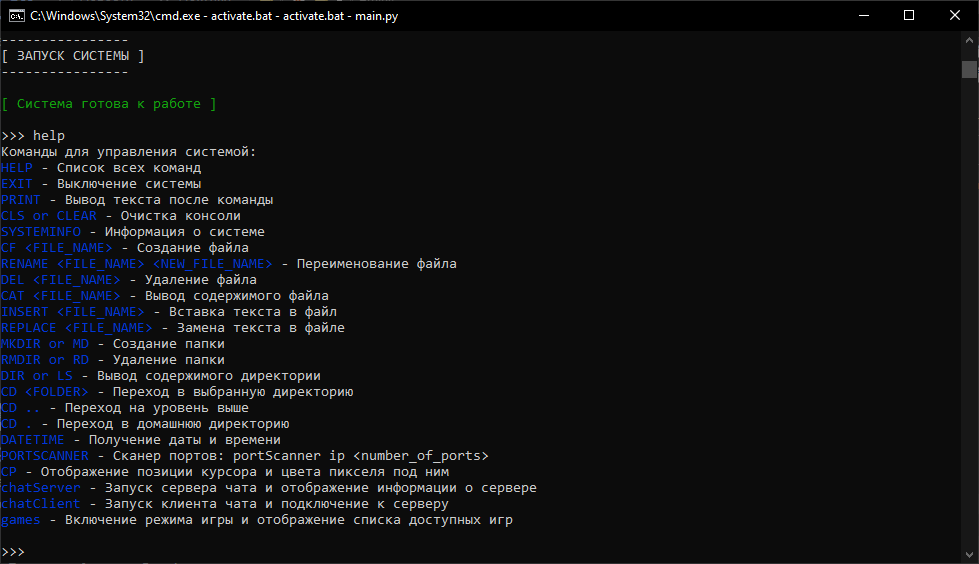

# Amina

Amina - a virtual operating system (OS) written in python.



---

To install this program, you need to duplicate this repository to the directory of your choice with the command:

```git
git clone https://github.com/Fadis-Fairushin/Amina.git
```

---

After that, create a virtual machine inside the installed directory and activate it with the appropriate commands:

```python
python -m venv venv
```

For Windows:

```python
venv\Scripts\activate.bat
```

For Linux and MacOS:

```python
source venv/bin/activate
```

---

Open the console and go to the program directory and enter the following command to install all modules:

```python
pip install -r requirements.txt
```

---

Now you can run the program with the command:

```python
python main.py
```

Or if you are on Windows, then double-click on the activate.bat file